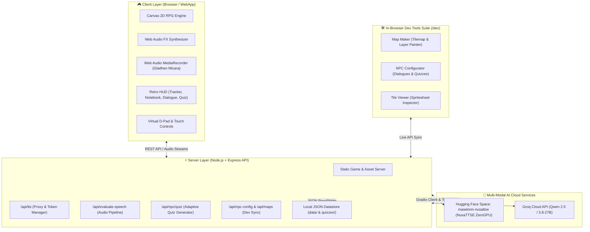

# NusaQuest — Petualangan Basa Jawa

<div align="center">

**Platform Edukasi Game RPG 2D Interaktif untuk Pelestarian Bahasa Daerah Berbasis AI Multi-Modal, NusaTTSE & Groq LLM.**

*Dikembangkan untuk Proposal Prototipe **BAIFEST 2026** (Kategori Inovasi Pembelajaran Digital).*

[](https://developer.mozilla.org/en-US/docs/Web/JavaScript)
[](https://nodejs.org/)
[](https://expressjs.com/)
[](https://groq.com/)
[](https://huggingface.co/spaces/MasElonn/NusaTTSE)
[](https://developer.mozilla.org/en-US/docs/Web/API/Canvas_API)
[](https://developer.mozilla.org/en-US/docs/Web/API/Web_Audio_API)
[]()
[](LICENSE)

</div>

---


> ### Overview NusaQuest
> **NusaQuest** merupakan platform edukasi berbasis gamifikasi petualangan RPG *top-down retro 16-bit* dengan ekosistem kecerdasan buatan (*Multi-Modal Speech & Language Intelligence*). Pemain menjelajahi Desa Karangjati, berinteraksi dengan warga desa (*NPC*), mempelajari kosakata (*unggah-ungguh basa*), menguji pelafalan secara langsung (*Gladhen Micara*), dan menyelesaikan kuis adaptif dinamis yang dirangkai secara *real-time* oleh Large Language Model.

---

## 📌 Ringkasan Proyek

Generasi muda saat ini menghadapi degradasi minat dan keakraban terhadap bahasa daerah (khususnya Bahasa Jawa: *Ngoko*, *Krama Madya*, dan *Krama Inggil*). Metode pembelajaran konvensional berbasis hafalan buku teks seringkali dirasa membosankan dan minim ruang praktik berbicara yang interaktif.

**NusaQuest** hadir sebagai solusi gamifikasi petualangan edukatif:
1. **Belajar Kontekstual**: Kosakata dan tata bahasa dipelajari secara natural melalui dialog sosial sehari-hari dengan NPC di berbagai lokasi desa (Pasar, Sawah, Rumah Warga).
2. **Evaluasi Pengucapan Suara (Pronunciation AI)**: Memanfaatkan model **NusaTTSE** di Hugging Face untuk sintesis suara autentik Basa Jawa dan evaluasi kemiripan pengucapan (*speech-to-text alignment & phonetic scoring*).
3. **Kuis Adaptif Dinamis (Generative AI)**: Integrasi **Groq LLM (`qwen/qwen3.8-27b`)** menyusun soal evaluasi baru setiap kali pemain berdialog, memastikan pertanyaan tidak monoton dan adaptif terhadap riwayat belajar pemain.
4. **Dev Suite Terpadu**: Dilengkapi peralatan mandiri (*in-browser visual editor suite*) untuk perancangan peta (*Map Maker*), konfigurasi dialog/NPC (*NPC Configurator*), dan inspeksi aset (*Tile Viewer*).

---

## 🏛️ Arsitektur Sistem & Alur Pembelajaran

Arsitektur sistem NusaQuest mengintegrasikan antarmuka *front-end* ringan tanpa dependensi berat dengan *backend* cerdas berbasis Node.js/Express dan layanan inferensi AI Cloud:



---

## 🚀 Fitur Utama NusaQuest

### 1. 🎮 2D Canvas Retro RPG Engine
- **Performa Ringan**: Dibangun murni menggunakan HTML5 Canvas 2D murni tanpa *framework game* berat, memastikan waktu muat instan (*zero-bundle-lag*).
- **Smooth Camera & Collision Grid**: Sistem kamera *smooth-lerping* yang mengikuti pergerakan pemain, dengan layer deteksi tabrakan (*collision masking*) berbasis matriks petak.
- **Animasi Karakter 4 Arah**: Siklus animasi langkah (*walk cycle*) 4 arah untuk pemain dan NPC warga desa.
- **Retro Visual Theme**: Tipografi piksel *Press Start 2P* berpadu dengan *Quicksand* untuk kenyamanan membaca teks panjang pada resolusi tinggi/Retina.

### 2. 🎙️ Gladhen Micara (Evaluasi Pengucapan AI NusaTTSE)
- **Sintesis Suara Asli Basa Jawa**: Mendengarkan contoh pengucapan berintonasi alami (`jv-ID-SitiNeural` / `jv-ID-DimasNeural`) sebelum mulai berbicara.
- **Studio Perekaman Terintegrasi**: Perekam suara berbasis browser dengan visualisasi gelombang animasi (*live audio wave pulses*) dan penghitung durasi.
- **Analisis Kata Demi Kata (*Word-by-Word Breakdown*)**: Menganalisis akurasi pengucapan tiap suku kata menggunakan algoritma pencocokan fonetik dan memberi skor kelancaran (0–100) serta umpan balik motivatif.

### 3. 🧠 Kuis Adaptif Real-Time (Groq LLM)
- **Generasi Soal Dinamis**: Server memanfaatkan model `qwen/qwen3.8-27b` via Groq untuk merangkai kuis pemahaman makna kata dan kalimat secara otomatis dari naskah dialog NPC yang baru saja diucapkan.
- **Anti-Pengulangan Cerdas**: Menganalisis riwayat kuis sebelumnya (`data/quizzes/{npcId}.json`) agar pemain selalu mendapatkan variasi pertanyaan baru.
- **Fallback Rule-Based Generator**: Menjamin kuis tetap berjalan 100% mulus dengan generator lokal cerdas jika koneksi internet terputus atau batas kuota API tercapai.

### 4. 📜 Sistem Gamifikasi Budaya & Buku Tembung
- **Misi Budaya (*Cultural Questlines*)**: Jalur misi bertingkat dari perkenalan warga, transaksi pasar, hingga etika bertamu.
- **Buku Tembung (*Vocabulary Notebook*)**: Jurnal saku digital yang mencatat otomatis setiap kosakata Basa Jawa baru yang ditemukan lengkap dengan terjemahan Bahasa Indonesia.
- **XP & Lencana Budaya**: Raih poin pengalaman (*XP*) dan buka trofi penghargaan budaya seperti *"Pitepangan Basa"*, *"Basa Krama Expert"*, dan *"Pamicara Luhur"*.

### 5. 📱 Ramah Perangkat Bergerak (*Mobile & Touch Ready*)
- **Virtual D-Pad & Tombol Aksi**: Kontrol sentuh intuitif (*Maju, Kiri, Kanan, Mundur, Gunem/Interaksi, Misi, Buku, Suara*).
- **Overlay Kunci Rotasi (*Rotate Screen Guard*)**: Notifikasi visual otomatis jika perangkat dibuka pada orientasi potret, mengarahkan pemain ke mode lanskap.
- **Kustomisasi Tombol (*Keybind Settings*)**: Opsi untuk mengubah pemetaan tombol keyboard dan menyalakan/mematikan kontrol sentuh di menu Pengaturan.

### 6. 🛠️ Dev Suite Terpadu (`/dev`)
- **Map Maker (`/dev/map_maker.html`)**: Editor peta visual dengan fitur layer *Ground*, *Obstacles*, *Overlay*, kuas seleksi petak (*brush/eraser*), *undo/redo*, dan *live save* ke server.
- **NPC Configurator (`/dev/npc_config.html`)**: Konfigurasi nama, peran, dialog bertingkat, daftar kosakata yang diajarkan, koordinat spawn, dan pratinjau kuis AI.
- **Tile Viewer (`/dev/tile_viewer.html`)**: Inspektor spritesheet, kalibrasi grid ukuran petak (16px), dan visualizer aset grafis.

---

## 💻 Tech Stack

| Kategori | Teknologi | Deskripsi |
| :--- | :--- | :--- |
| **Front-End Engine** | HTML5 Canvas 2D, Vanilla JavaScript (ES2023) | Render game, logika pemain, NPC, dan sistem quest |
| **Styling & UI** | CSS3 Modern, Retro Glassmorphism, CSS Grid | Tema retro RPG, responsive layout, anim visual |
| **Icons & Typography** | [Lucide Icons](https://lucide.dev/), [Google Fonts (Press Start 2P & Quicksand)](https://fonts.google.com/) | Ikon vektor jernih dan font ramah piksel |
| **Back-End Server** | [Node.js](https://nodejs.org/) & [Express.js](https://expressjs.com/) | REST API, static asset server, token manager |
| **Voice & Speech AI** | [NusaTTSE](https://huggingface.co/spaces/MasElonn/NusaTTSE) (Gradio API via HF Spaces) | Sintesis audio Basa Jawa & evaluasi pengucapan |
| **Generative LLM** | [Groq Cloud SDK](https://groq.com/) (`qwen/qwen3.8-27b`) | Generator soal kuis interaktif tanpa pengulangan |
| **Audio Synthesizer** | Web Audio API (OscillatorNode, GainNode) | Generator efek suara 8-bit (*click, quest finish, fanfare*) |
| **Data Storage** | Native JSON Storage (`data/`, `data/quizzes/`) | Penyimpanan konfigurasi peta, dialog, quest, dan riwayat kuis |

---

## 📁 Struktur Direktori Proyek

```text
NusaQuest/
├── assets/                  # Aset grafis game & audio
│   ├── characters/          # Spritesheet karakter pemain & NPC (4 arah)
│   ├── tiles/               # Spritesheet tileset (Kenney RPG, Roguelike, Urban)
│   └── audio/               # Efek suara & musik latar
├── data/                    # Berkas database JSON game
│   ├── dialogues.json       # Naskah percakapan & kosakata NPC
│   ├── maps.json            # Metadata & layout peta Desa Karangjati
│   ├── npc_placements.json  # Posisi koordinat spawn NPC di peta
│   ├── quests.json          # Alur misi budaya, XP, & reward lencana
│   ├── tile_map.json        # Layer matriks tilemap aktif
│   └── quizzes/             # Riwayat kuis terpisah per NPC ({npcId}.json)
├── dev/                     # Dev Suite (In-browser game design tools)
│   ├── dev.css              # Styling khusus antarmuka developer tools
│   ├── index.html           # Hub portal navigasi Dev Suite
│   ├── map_maker.html       # Visual Tilemap & Layer Editor
│   ├── npc_config.html      # NPC Dialogues & AI Quiz Tuning
│   └── tile_viewer.html     # Spritesheet & Atlas Grid Inspector
├── js/                      # Modul logika JavaScript game
│   ├── assets.js            # Asset loader & sprite slicer
│   ├── audio.js             # Web Audio API sound effects & synth
│   ├── main.js              # Game loop utama, render pipeline, & input listener
│   ├── npcs.js              # Entitas NPC, deteksi kedekatan, & interaksi
│   ├── player.js            # Entitas pemain, state gerak, & bounding box
│   ├── quests.js            # Sistem manajemen quest, pelacak misi, & XP
│   ├── sidebar.js           # Pengelola panel navigasi & Buku Tembung
│   ├── speech_evaluator.js  # Integrasi mikrofon & evaluasi pengucapan NusaTTSE
│   └── ui.js                # Pengontrol modal kuis, dialog, toast, & options
├── .env.example             # Contoh berkas konfigurasi variabel lingkungan
├── CREDITS.md               # Atribusi lisensi aset grafis & tipografi
├── index.html               # Halaman utama game NusaQuest
├── package.json             # Dependensi & script eksekusi Node.js
├── server.js                # Server backend Express & proxy layanan AI
└── style.css                # Desain sistem & stylesheet utama game
```

---

## 🕹️ Panduan Kontrol & Tombol

| Aksi | Keyboard (Desktop) | Kontrol Sentuh (Mobile) |
| :--- | :--- | :--- |
| **Bergerak (Maju / Mundur / Samping)** | `W`, `A`, `S`, `D` atau `Tombol Panah` | Virtual D-Pad (Atas, Bawah, Kiri, Kanan) |
| **Bicara / Interaksi NPC** | `E` atau `Spasi` | Tombol **GUNEM (E)** |
| **Lanjut Dialog / Kuis** | `E` atau `Enter` | Tombol **Lanjut** |
| **Buka / Tutup Quest Log** | `Q` | Tombol **Misi** (Top HUD / Mobile) |
| **Buka / Tutup Buku Tembung** | `N` atau `Tab` | Tombol **Buku** (Top HUD / Mobile) |
| **Nyalakan / Matikan Suara** | `M` | Tombol **Suara** |
| **Buka Pengaturan (Options)** | Tombol *Options* di Layar Mulai | Tombol *Options* |

---

## 🚀 Panduan Memulai (Quick Start)

### 1. Prasyarat Sistem
- [Node.js](https://nodejs.org/) versi 18.0 atau yang lebih baru
- [npm](https://www.npmjs.com/) (terpasang otomatis bersama Node.js)
- *Optional*: Mikrofon browser aktif untuk mencoba fitur latihan pengucapan (*Gladhen Micara*).

### 2. Kloning Repositori & Instalasi Dependensi
```bash
# Kloning repositori proyek
git clone https://github.com/biebpp/NusaQuest.git

# Masuk ke direktori proyek
cd NusaQuest

# Instal paket dependensi
npm install
```

### 3. Konfigurasi Lingkungan (`.env`)
Buat berkas `.env` di direktori utama (atau salin dari template):
```bash
# Port server lokal (opsional, default: 3000)
PORT=3000

# API Key Groq untuk pembuatan kuis adaptif real-time
GROQ_API_KEY=gsk_your_groq_api_key_here

# Endpoint Hugging Face Space NusaTTSE (opsional)
HF_SPACE_URL=https://maselonn-nusattse.hf.space

# Hugging Face Access Token (opsional, meningkatkan kuota ZeroGPU)
HF_TOKEN=hf_your_huggingface_token_here
```

### 4. Menjalankan Server
```bash
# Menjalankan server aplikasi
npm start
```

Buka peramban (*browser*) Anda dan akses:
- **Game Utama**: [`http://localhost:3000`](http://localhost:3000)
- **Dev Suite Hub**: [`http://localhost:3000/dev`](http://localhost:3000/dev)
- **Map Maker**: [`http://localhost:3000/dev/map_maker.html`](http://localhost:3000/dev/map_maker.html)
- **NPC Configurator**: [`http://localhost:3000/dev/npc_config.html`](http://localhost:3000/dev/npc_config.html)

---

## 🎨 Aset & Atribusi Lisensi

Semua aset visual dan font yang digunakan dalam NusaQuest merupakan aset berlisensi terbuka (*open license / public domain*):
- **Tileset Lingkungan**: [Kenney Roguelike, RPG, & RPG Urban Pack](https://kenney.nl/) ([CC0 1.0 Universal - Public Domain](https://creativecommons.org/publicdomain/zero/1.0/)).
- **Spritesheet Karakter**: Derived from LPC / OpenGameArt / [Grid Engine Collection](https://github.com/Annoraaq/grid-movement) ([MIT / CC-BY-SA 3.0](https://creativecommons.org/licenses/by-sa/3.0/)).
- **Tipografi**: [Press Start 2P](https://fonts.google.com/specimen/Press+Start+2P) (CodeMan38) & [Quicksand](https://fonts.google.com/specimen/Quicksand) (Andrew Paglinawan) ([SIL Open Font License 1.1](https://scripts.sil.org/OFL)).
- Rincian lengkap tersedia di berkas [CREDITS.md](CREDITS.md).

---

## 📄 Lisensi & Tim Pengembang

- **Proyek**: NusaQuest — Proposal Game Edukasi BAIFEST 2026
- **Penulis**: [Yiersan Team](https://github.com/biebpp/NusaQuest)
- **Lisensi**: [MIT License](LICENSE)

<div align="center">
  <sub>Mugi-mugi aplikasi menika saget paring manfaat kagem nglestarekaken Basa saha Budaya Jawa. 🌾✨</sub>
</div>
